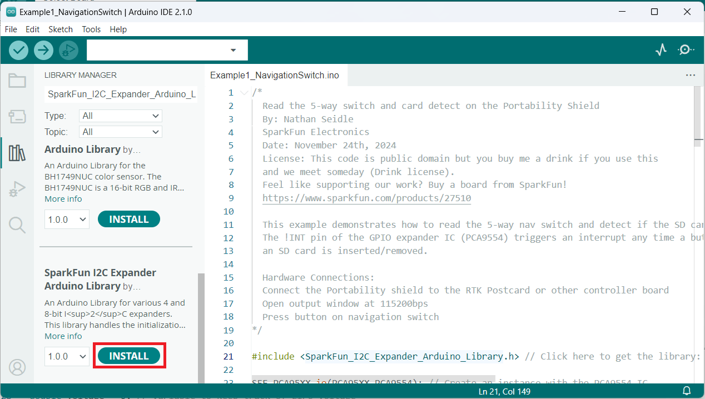
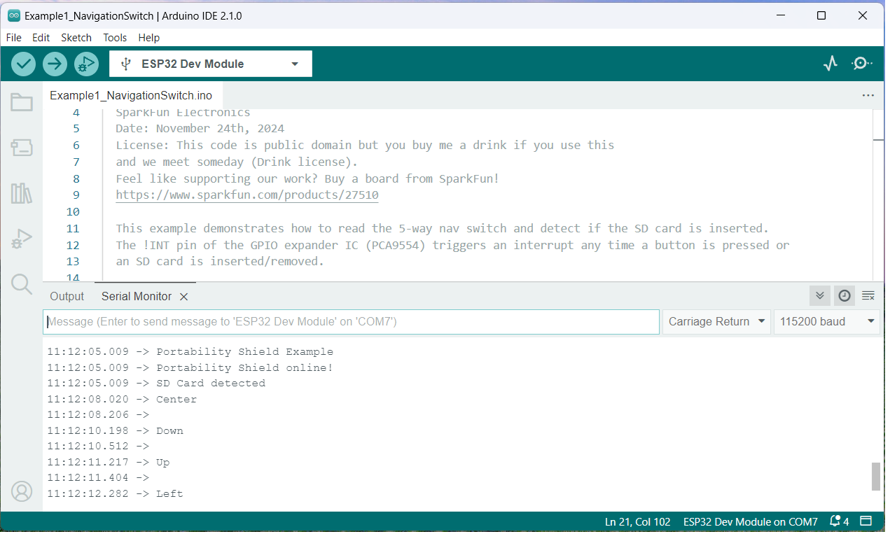
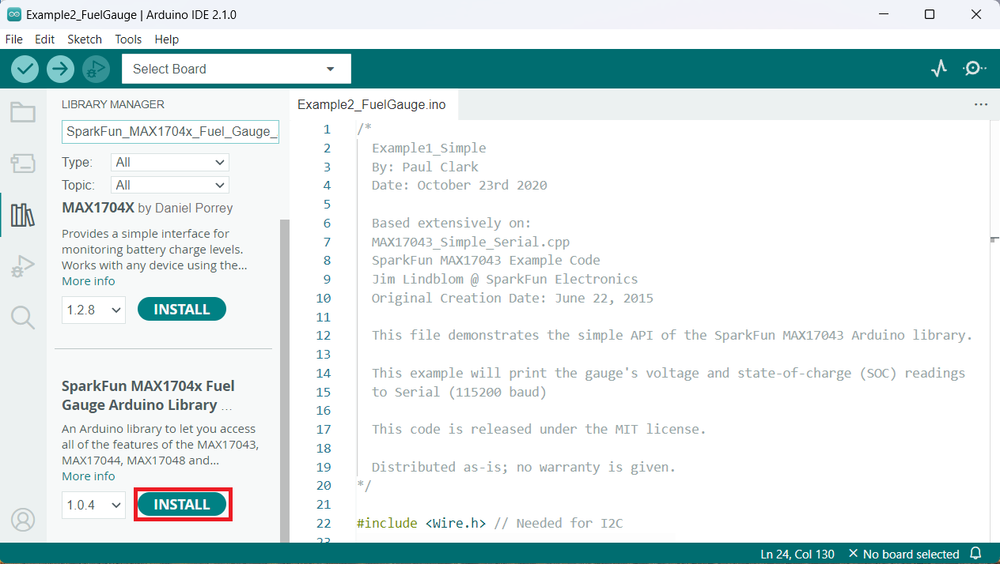
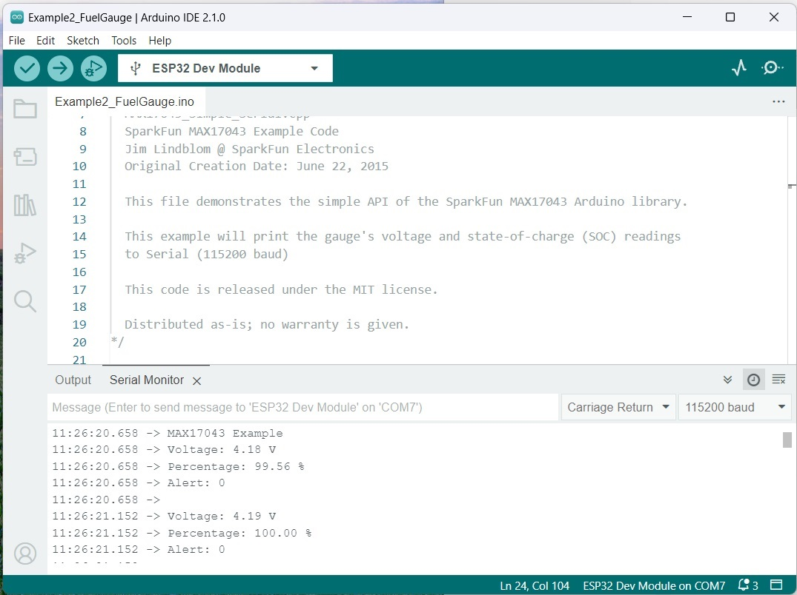
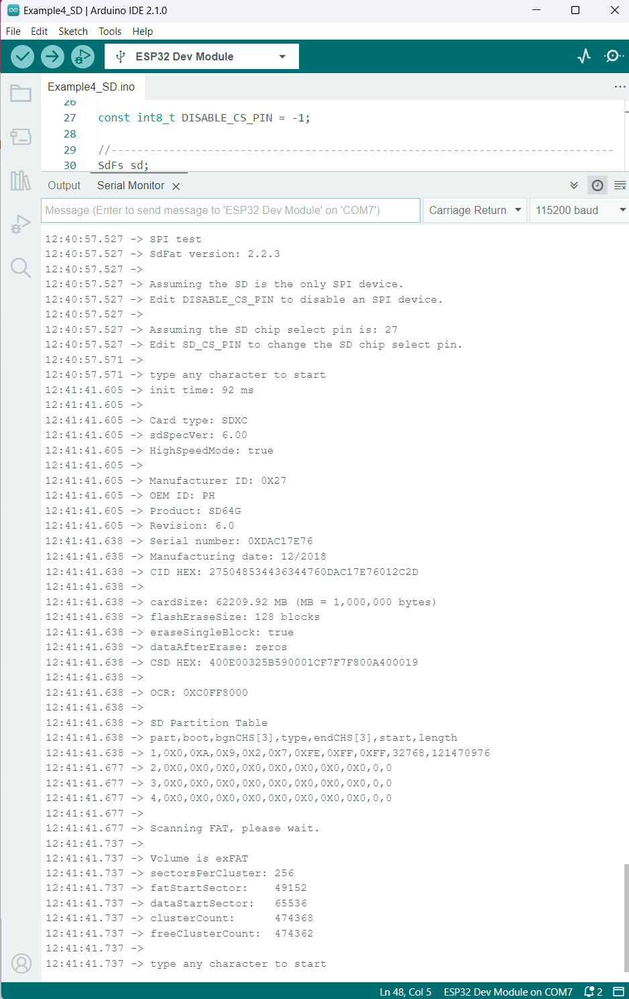

###Example 1: Navigation Switch

This example demonstrates how to use the navigation switch and detect if the SD card is inserted. The !INT pin of the GPIO expander IC (PCA9554) triggers an interrupt any time a button is pressed or an SD card is inserted/removed.

The code for this example can be found in the [Firmware](../Firmware/Example1_NavigationSwitch/) folder of this repository. Alternatively, you can expand the link below and copy and paste the code into a shiny new Arduino sketch: 

??? "Example 1 Arduino Code"
	```
	--8<-- "https://raw.githubusercontent.com/sparkfun/SparkFun_Portability_Shield/refs/heads/main/Firmware/Example1_NavigationSwitch/Example1_NavigationSwitch.ino"
	```


One thing to note is that you will also need to install the SparkFun I2C Expander Arduino Library if you haven't already. You can search the library from within the Arduino Library manager, download the zip from [the GitHub Repository](https://github.com/sparkfun/SparkFun_I2C_Expander_Arduino_Library/archive/refs/heads/main.zip) and install it manually, or you can click the link from within the code. Clicking the link will show something like the following: 

<figure markdown>
[{ width="90%" }](assets/img/I2CExpanderLibraryInstall.png "Click to enlarge")
<figcaption markdown>SparkFun I2C Expander Arduino Library Install</figcaption>
</figure>


Make sure you've selected the correct board (in this case, you will need to use ESP32 Dev Module from espressif) and port in the Tools menu and then hit the upload button. Once the code has finished uploading, go ahead and open a [Serial Monitor](https://learn.sparkfun.com/tutorials/terminal-basics). You should see something similar to the following. 

<figure markdown>
[{ width="90%" }](assets/img/Example1_Output.png "Click to enlarge")
<figcaption markdown>Example 1 Output</figcaption>
</figure>


###Example 2: Fuel Gauge
This file demonstrates the simple API of the SparkFun MAX17043 Arduino library. Make sure you have a LiPo battery plugged into the JST port. 

The code for this example can be found in the [Firmware](../Firmware/Example2_FuelGauge/) folder of this repository. Alternatively, you can expand the link below and copy and paste the code into a shiny new Arduino sketch: 

??? "Example 2 Arduino Code"
    ```
    --8<-- "https://github.com/sparkfun/SparkFun_Portability_Shield/raw/refs/heads/main/Firmware/Example2_FuelGauge/Example2_FuelGauge.ino"
    ```

You will also need to install the SparkFun MAX1704x Fuel Gauge Arduino Library if you haven't already. You can search the library from within the Arduino Library manager, download the zip from [the GitHub Repository](https://github.com/sparkfun/SparkFun_MAX1704x_Fuel_Gauge_Arduino_Library/archive/refs/heads/main.zip) and install it manually, or you can click the link from within the code. Clicking the link will show something like the following: 
 

<figure markdown>
[{ width="90%" }](assets/img/MAX17043LibraryInstall.png "Click to enlarge")
<figcaption markdown>SparkFun MAX1704x Fuel Gauge Arduino Library Install</figcaption>
</figure>


Make sure you've selected the correct board and port in the Tools menu and then hit the upload button. Once the code has finished uploading, go ahead and open a [Serial Monitor](https://learn.sparkfun.com/tutorials/terminal-basics) at 115200 baud. You should see the gauge's voltage and state-of-charge (SOC) readings, similar to the following: 

<figure markdown>
[{ width="90%" }](assets/img/Example2_Output.jpg "Click to enlarge")
<figcaption markdown>Example 2 Output</figcaption>
</figure>


###Example 3: Display

This example demonstrates how to display on the 1.3" OLED and read the fuel gauge. You should have the Portability Shield connected to the RTK Postcard or other controller and a LiPo battery plugged into the JST port. 

The code for this example can be found in the [Firmware](../Firmware/Example3_Display/) folder of this repository. Alternatively, you can expand the link below and copy and paste the code into a shiny new Arduino sketch: 

??? "Example 3 Arduino Code"
	```
	--8<-- "https://raw.githubusercontent.com/sparkfun/SparkFun_Portability_Shield/refs/heads/main/Firmware/Example3_Display/Example3_Display.ino"
	```

You will also need both the SparkFun Qwiic OLED Arduino Library as well as the SparkFun MAX1704x Fuel Gauge Arduino Library. If you haven't already installed these, you can search them from within the Arduino Library manager and install them from there. Alternatively, you can download the zips from their respective GitHub Repositories [here(Fuel Gauge)](https://github.com/sparkfun/SparkFun_MAX1704x_Fuel_Gauge_Arduino_Library/archive/refs/heads/main.zip) and [here(Qwiic OLED)](https://github.com/sparkfun/SparkFun_Qwiic_OLED_Arduino_Library/archive/refs/heads/main.zip), and install them manually. 


Make sure you've selected the correct board and port in the Tools menu and then hit the upload button. Once the code has finished uploading, you should see the gauge's voltage and state-of-charge (SOC) readings, similar to the the output for Example 2. 
The 1.3" OLED display should show a bouncing box like so: 


<figure markdown>
[{ width="90%" }](assets/img/27510-Portability-Shield-GIF.gif "Click to enlarge")
<figcaption markdown>Example 3</figcaption>
</figure>


###Example 4: SD Card

This example will mount an SD card, analyze the type of card, and output the analysis via the Serial Monitor. 

Go ahead and connect the Portability Shield to the RTK Postcard or other controller board. Insert a microSD card into the socket. Cards up to 512GB should work.

The code for this example can be found in the [Firmware](../Firmware/Example4_SD/) folder of this repository. Alternatively, you can expand the link below and copy and paste the code into a shiny new Arduino sketch: 

??? "Example 4 Arduino Code"
	```
	--8<-- "https://github.com/sparkfun/SparkFun_Portability_Shield/raw/refs/heads/main/Firmware/Example4_SD/Example4_SD.ino"
	```


You will also need to install the SDFat Arduino Library if you haven't already. You can search the library from within the Arduino Library manager, download the zip from [the GitHub Repository](https://github.com/sparkfun/SparkFun_Qwiic_OLED_Arduino_Library/archive/refs/heads/main.zip) and install it manually, or you can click the link from within the code. 
 

Make sure you've selected the correct board and port in the Tools menu and then hit the upload button. Once the code has finished uploading, go ahead and open a [Serial Monitor](https://learn.sparkfun.com/tutorials/terminal-basics) at 115200 baud. Once you type in any key in the Message Field and send it, the code will analyze the SD card and output something similar to the following: 

<figure markdown>
[{ width="90%" }](assets/img/Example4_Output.png "Click to enlarge")
<figcaption markdown>Example 4 Output</figcaption>
</figure>
