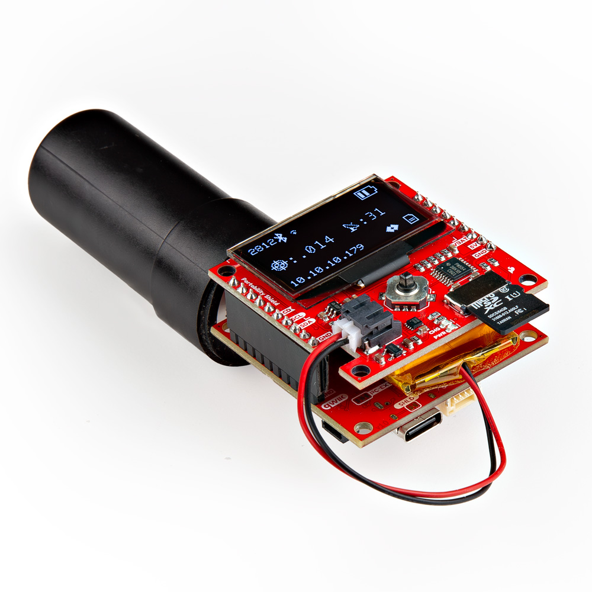

The Portability Shield has been designed to be usable with any compatible main board. Here we have soldered in headers and it is plugged into the [RTK Postcard](https://www.sparkfun.com/products/26916). Note that there is an antenna attached to the module, as well as a LiPo battery plugged into the JST port. 

<figure markdown>
[{ width="75%" }](assets/board_files/27510-Portability-Shield-Action-1.jpg "Click to enlarge")
<figcaption markdown>SparkFun Portability Shield and RTK Postcard</figcaption>
</figure>

