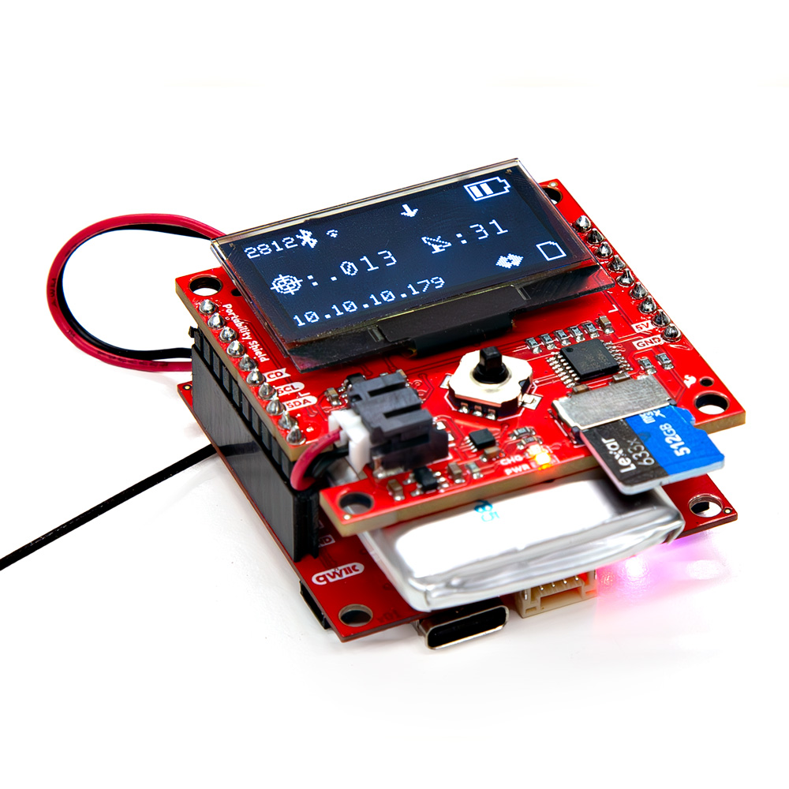

The SparkFun Portability Shield has been designed to plug in directly to the 

The Portability Shield has been designed to be usable with any compatible main board. Here it has shown plugged into the [RTK Postcard](https://www.sparkfun.com/products/26916).

<figure markdown>
[{ width="75%" }](assets/board_files/27510-Portability-Shield-Action-square.jpg "Click to enlarge")
<figcaption markdown>SparkFun Portability Shield and RTK Postcard</figcaption>
</figure>

