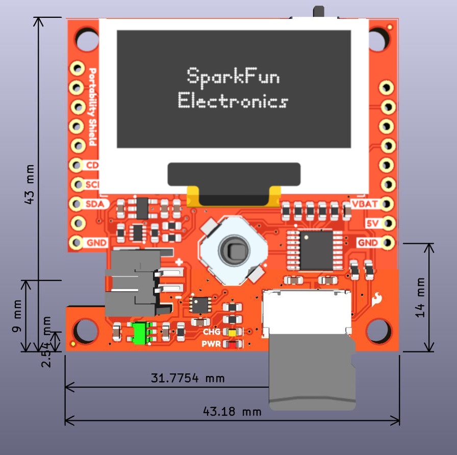

## OLED
The 1.3" OLED display is a 128 x 64 dot matrix panel. 7-bit unshifted I2C address is 0x3D. 

For more information, refer to the [datasheet](https://cdn.sparkfun.com/assets/learn_tutorials/3/0/8/SSD1306.pdf).

## D-Pad

The D-Pad allows for navigation of the configuration modes and menus related to the RTK. 

## GPIO Expander

The GPIO expander is used for D-Pad functionality. The 7-bit Unshifted Address is 0x18.

## Power

## Fuel Gauge

7-bit unshifted address is 0x36

## LiPo Charging Circuit

<figure markdown>
[{ width="90%" }](assets/img/ChargeEqn.png "Click to enlarge")
<figcaption markdown>Charge Circuit</figcaption>
</figure>

## MicroSD Card

The microSD card slot allows for data logging or easy upload of programming files.

!!! warning
	Do NOT drive the microSD card pins high if the card is not powered. Damage could occur! 

<!-- ## Battery Charging Circuit

<figure markdown>
[{ width="90%" }](assets/img/chargeCircuitEquations.jpg "Click to enlarge")
<figcaption markdown>Charge Circuit</figcaption>
</figure>

-->

## Shield Connectors

If 5V is present, LiPo charging commences. 
If 5V is absent, battery provides VBATT to mainboard
3.3V is not provided ot mainboard. 
5V/VBATT powers local 3.3V_P. 

## I2C

    <table>
        <tr>
            <th style="text-align: center; border: solid 1px #cccccc;">D/C
            </th>
            <th style="text-align: center; border: solid 1px #cccccc;">I2C Addr
            </th>
        </tr>
        <tr>
            <td style="text-align: center; border: solid 1px #cccccc;">0
            </td>
            <td style="text-align: center; border: solid 1px #cccccc;">0x3C
            </td>
        </tr>
        <tr>
            <td style="text-align: center; border: solid 1px #cccccc;">1
            </td>
            <td style="text-align: center; border: solid 1px #cccccc;">0x3D (default)
            </td>
        </tr>
    </table>

For I2C Mode

BS1 high
BS0 and BS2 low
D1/D2 shorted

## Jumpers

??? note "Never modified a jumper before?"
	Check out our <a href="https://learn.sparkfun.com/tutorials/664">Jumper Pads and PCB Traces tutorial</a> for a quick introduction!
	

		<a href="https://learn.sparkfun.com/tutorials/664">
		 
        How to Work with Jumper Pads and PCB Traces</a>
	

* <b>CHG:</b>
* <b>PWR:</b>
* <b>D/C:</b>

* <b>I2C:</b>
	The SparkFun Portability Shield has built-in 2.2k pull-up resistors on the SDA and SCL lines. These are needed for normal I2C communication. The I2C jumper has two small traces connecting the pull-ups to 3.3V. **For general use you can leave this jumper unmodified.** If you have many (over 7) devices on the I2C bus, each with their own pull up resistors, then you may want to [cut the I2C jumpers](https://learn.sparkfun.com/tutorials/how-to-work-with-jumper-pads-and-pcb-traces) to disconnect the 2.2k resistors on each Qwiic board.

## Board Dimensions

The board dimensions are illustrated in the drawing below; the listed measurements are in millimeters.

<figure markdown>
[{ width="600" }](assets/board_files/SparkFun_Portability_Shield_BoardDimensions.jpg "Click to enlarge")
<figcaption markdown>SparkFun Portability Shield Board Dimensions</figcaption>
</figure>

	