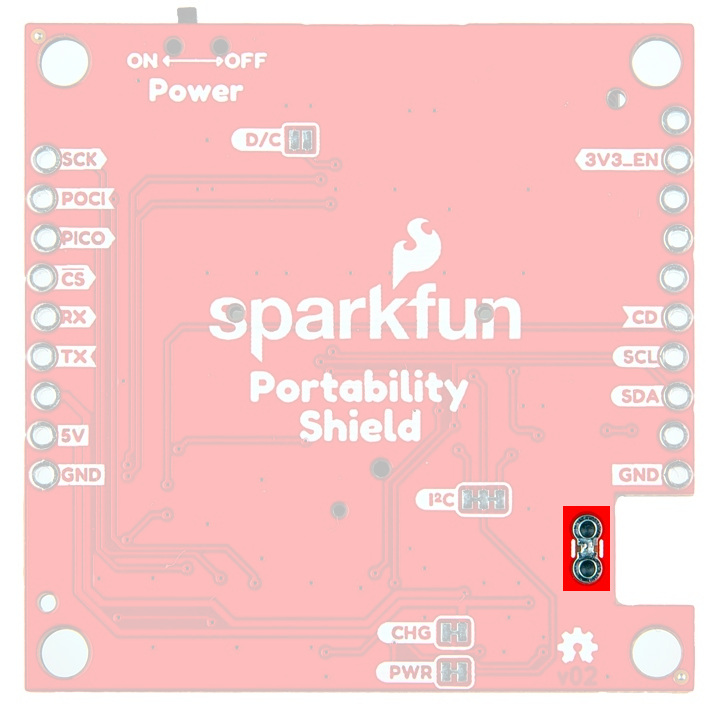
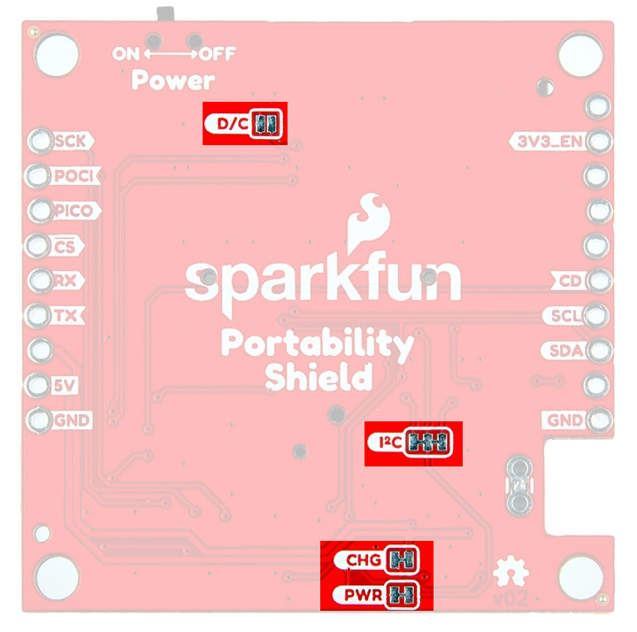

## OLED
The 1.3" OLED is a small, monochrome, blue on black display with a 128 x 64 dot matrix panel and a 7-bit unshifted I2C address of 0x3D. To change the I2C address to 0x3C, cut the D/C jumper on the back of the board. For more information, refer to the [datasheet](https://cdn.sparkfun.com/assets/learn_tutorials/3/0/8/SSD1306.pdf).

<figure markdown>
[{ width="75%" }](assets/img/27510-Portability-Shield_OLED.jpg "Click to enlarge")
<figcaption markdown>1.3" OLED Screen</figcaption>
</figure>

	

## Navigation Switch

The Navigation Switch allows for navigation of the configuration modes and menus related to the RTK or other loaded software. 

<figure markdown>
[{ width="75%" }](assets/img/27510-Portability-Shield_NavSwitch.jpg "Click to enlarge")
<figcaption markdown>Navigation Switch</figcaption>
</figure>

## GPIO Expander

The TCA9554 GPIO Expander is used for I2C interfacing with the Navigation Switch, 1.3" OLED display, the fuel gauge, and the SD Card Detect. Its 7-bit unshifted address is 0x20.

<figure markdown>
[{ width="75%" }](assets/img/27510-Portability-Shield_GPIOExpander.jpg "Click to enlarge")
<figcaption markdown>GPIO Expander</figcaption>
</figure>

## Power

Power is provided by either the LiPo Battery or the 5V/GND pins. Maximum input to the board is 5V. 

<figure markdown>
[{ width="75%" }](./assets/img/27510-Portability-Shield_JSTandPins.jpg "Click to enlarge")
<figcaption markdown>Battery Connector/Power Pins</figcaption>
</figure>

## Current Measurement 

There are two plated through holes available on the bottom of the board to measure current if desired. 

<figure markdown>
[{ width="75%" }](./assets/img/27510-Portability-Shield_Measure.jpg "Click to enlarge")
<figcaption markdown>Current Measurement PTHs</figcaption>
</figure>

## On/Off Switch

How handy! There is an On/Off switch at the top of the board. 

<figure markdown>
[{ width="75%" }](assets/img/27510-Portability-Shield_OnOffSwitch.jpg "Click to enlarge")
<figcaption markdown>On/Off Switch</figcaption>
</figure>

## Fuel Gauge

The MAX17048 uses the Li+ battery-modeling algorithm ModelGauge™ to track the battery relative state-of-charge (SOC) continuously over widely varying charge and discharge conditions. This eliminates current-sense resistor and battery learn cycles required in traditional fuel gauges and allows for the most accurate battery percentage readings. Its 7-bit unshifted address is 0x36. For more information, you can refer to the [datasheet](https://cdn.sparkfun.com/assets/5/2/7/6/6/MAX17048-MAX17049.pdf). 

<figure markdown>
[{ width="75%" }](assets/img/27510-Portability-Shield_FuelGauge.jpg "Click to enlarge")
<figcaption markdown>Fuel Gauge</figcaption>
</figure>

## LiPo Charging Circuit

The charge circuit charges Li+ batteries at 500mA. The equation below shows our calculation for this rate. 

<figure markdown>
[{ width="75%" }](assets/img/ChargeEqn.png "Click to enlarge")
<figcaption markdown>Charge Circuit</figcaption>
</figure>

## MicroSD Card

The microSD Socket Friction Fit slot allows for data logging or easy upload of programming files. 

!!! warning
	Do NOT drive the microSD card pins high if the card is not powered. Damage could occur! 

<figure markdown>
[{ width="75%" }](assets/img/27510-Portability-Shield_uSDCardSlot.jpg "Click to enlarge")
<figcaption markdown>microSD Card Slot</figcaption>
</figure>

<!-- ## Battery Charging Circuit

<figure markdown>
[{ width="75%" }](assets/img/chargeCircuitEquations.jpg "Click to enlarge")
<figcaption markdown>Charge Circuit</figcaption>
</figure>

-->

## Shield Connectors

The offset PTHs allow for a snug fit when soldering headers to the board. Once male headers are soldered in, the SparkFun Portability Shield can be fit to the main board of choice. 

If <b>5V</b> is present, LiPo charging commences. Below <b>5V</b>, the battery will provide VBATT to the mainboard 3.3V is not provided to mainboard - 5V/VBATT powers local 3.3V_P. 

<figure markdown>
[{ width="75%" }](assets/img/27510-Portability-Shield_ShldConnex.jpg "Click to enlarge")
<figcaption markdown>Shield Connectors</figcaption>
</figure>

## Jumpers

* <b>CHG:</b>
    Cutting this jumper will disconnect the power to the CHG LED on the front of the board. 

* <b>PWR:</b>
    Cutting this jumper will disconnect the power to the PWR LED on the front of the board. 

* <b>D/C:</b>
    Cutting this jumper will change the I2C address from 0x3D to 0x3C.

    <table>
        <tr>
            <th style="text-align: center; border: solid 1px #cccccc;">D/C
            </th>
            <th style="text-align: center; border: solid 1px #cccccc;">I2C Addr
            </th>
        </tr>
        <tr>
            <td style="text-align: center; border: solid 1px #cccccc;">0
            </td>
            <td style="text-align: center; border: solid 1px #cccccc;">0x3C
            </td>
        </tr>
        <tr>
            <td style="text-align: center; border: solid 1px #cccccc;">1
            </td>
            <td style="text-align: center; border: solid 1px #cccccc;">0x3D (default)
            </td>
        </tr>
    </table>

* <b>I2C:</b>
	The SparkFun Portability Shield has built-in 2.2k pull-up resistors on the SDA and SCL lines. These are needed for normal I2C communication. The I2C jumper has two small traces connecting the pull-ups to 3.3V. **For general use you can leave this jumper unmodified.** If you have many (over 7) devices on the I2C bus, each with their own pull up resistors, then you may want to [cut the I2C jumpers](https://learn.sparkfun.com/tutorials/how-to-work-with-jumper-pads-and-pcb-traces) to disconnect the 2.2k resistors on each Qwiic board.

<figure markdown>
[{ width="75%" }](assets/img/27510-Portability-Shield_Jumpers.jpg "Click to enlarge")
<figcaption markdown>Jumpers</figcaption>
</figure>

## Board Dimensions

The board dimensions are illustrated in the drawing below; the listed measurements are in millimeters.

<figure markdown>
[{ width="75%" }](assets/board_files/SparkFun_Portability_Shield_BoardDimensions.jpg "Click to enlarge")
<figcaption markdown>SparkFun Portability Shield Board Dimensions</figcaption>
</figure>

	