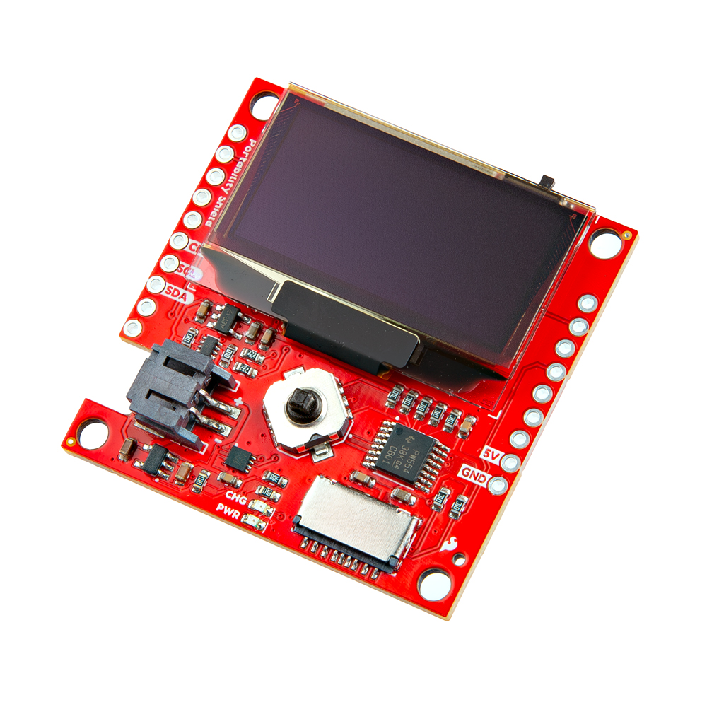

-    <a href="https://www.sparkfun.com/products/27510">
    **SparkFun Portability Shield** 
    **SKU:** DEV-27510

    ---

    <figure markdown>
    
    </figure></a>
    
- A small board that adds a display, navigation, logging, and battery management.

[Purchase from SparkFun :fontawesome-solid-cart-plus:{ .heart }](https://www.sparkfun.com/products/27510){ .md-button .md-button--primary }

## Required Materials

To follow along with this tutorial, you will need the following materials. You may not need everything, depending on what you have. Add it to your cart, read through the guide, and adjust the cart as necessary.

<table style="border-style:none">
    <tr>
        <td>
            <a href="https://www.sparkfun.com/products/27510">
                

                <h3 class="title">SparkFun Portability Shield</h3>
            </a>
            DEV-27510
        </td>
        <td>
            <a href="https://www.sparkfun.com/products/26916">
                

                <h3 class="title">SparkFun RTK Postcard</h3>
            </a>
            GPS-26916
        </td>
    </tr>
</table>

## Suggested Reading

Below are a few tutorials that may help users familiarize themselves with various aspects of the board.

-   <a href="https://learn.sparkfun.com/tutorials/what-is-gps-rtk">
    <figure markdown>
    
    </figure>
    </a>
    <a href="https://learn.sparkfun.com/tutorials/what-is-gps-rtk">**What is GPS RTK**
    </a>

<!-- 

    

        

            
        

    

The SparkFun Portability Shield takes advantage of the [Qwiic connect system](https://www.sparkfun.com/qwiic). We recommend familiarizing yourself with the **Logic Levels** and **I2C** tutorials.  Click on the banner above to learn more about [Qwiic products](https://www.sparkfun.com/qwiic).

    <iframe width="600" height="327" src="https://www.youtube.com/embed/x0RDEHqFIF8" title="SparkFun's Qwiic Connect System" frameborder="0" allow="accelerometer; autoplay; clipboard-write; encrypted-media; gyroscope; picture-in-picture" allowfullscreen></iframe>

 -->