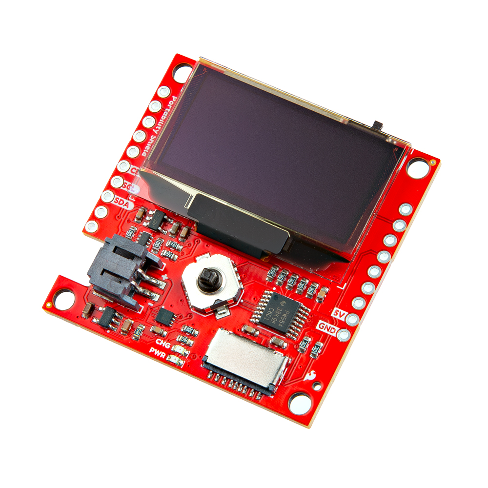

-    <a href="https://www.sparkfun.com/products/27510">
    **SparkFun Portability Shield** 
    **SKU:** DEV-27510

    ---

    <figure markdown>
    
    </figure></a>

- The SparkFun Portability Shield adds all the user interface bits needed to take a SparkFun dev board into the field. A LiPo battery connector, charger, fuel gauge, and an on/off switch take care of your power needs. A friction-fit microSD connector allow for datalogging. The 1.3" OLED and a 5-way navigation switch allow for an excellent user interface. Locking 0.1" headers along the edge of the shield make it easier to solder male pins in place.

    I2C is used to interface to the display, fuel gauge, and the 5 way navigation switch (GPIO expander PCA9554), SPI is used to communicate with the microSD card. The power switch uses an ideal diode (LM66200) to disconnect the battery from the system for a sleep current of approximately 4μA.

    <article style="text-align: center;" markdown>
    [Purchase from SparkFun :fontawesome-solid-cart-plus:{ .heart }](https://www.sparkfun.com/products/27510){ .md-button .md-button--primary }
    </article>

## Required Materials

To follow along with this tutorial, you will need the following materials. You may not need everything, depending on what you have. Add it to your cart, read through the guide, and adjust the cart as necessary.

-   <a href="https://www.sparkfun.com/sparkfun-portability-shield.html">
    <figure markdown>
    
    </figure>

    ---

    **SparkFun Portability Shield** 
    DEV-27510</a>

-   <a href="https://www.sparkfun.com/sparkfun-rtk-postcard.html">
    <figure markdown>
    
    </figure>

    ---

    **SparkFun RTK Postcard** 
    GPS-26916</a>

-   <a href="https://www.sparkfun.com/header-1x20-male-0-1.html">
    <figure markdown>
    
    </figure>

    ---

    **Header - 1x20 (Male, 0.1")** 
    PRT-29760</a>

-   <a href="https://www.sparkfun.com/lithium-ion-battery-850mah.html">
    <figure markdown>
    
    </figure>

    ---

    **Lithium Ion Battery - 850mAh** 
    PRT-13854</a>

-   <a href="https://www.sparkfun.com/microsd-card-1gb-class-4.htmll">
    <figure markdown>
    
    </figure>

    ---

    **microSD Card - 1GB (Class 4)** 
    COM-15107</a>

## Suggested Reading

Below are a few tutorials that may help users familiarize themselves with various aspects of the board.

-   <a href="https://learn.sparkfun.com/tutorials/what-is-gps-rtk">
    <figure markdown>
    
    </figure>
    </a>
    <a href="https://learn.sparkfun.com/tutorials/what-is-gps-rtk">**What is GPS RTK**
    </a>
-   <a href="https://docs.sparkfun.com/SparkFun_RTK_Everywhere_Firmware/">
    <figure markdown>
    
    </figure>
    </a>
    <a href="https://docs.sparkfun.com/SparkFun_RTK_Everywhere_Firmware/">**SparkFun RTK Everywhere Product Manual**
    </a>

<!--

    

        

            
        

    

The SparkFun Portability Shield takes advantage of the [Qwiic connect system](https://www.sparkfun.com/qwiic). We recommend familiarizing yourself with the **Logic Levels** and **I2C** tutorials.  Click on the banner above to learn more about [Qwiic products](https://www.sparkfun.com/qwiic).

    <iframe width="600" height="327" src="https://www.youtube.com/embed/x0RDEHqFIF8" title="SparkFun's Qwiic Connect System" frameborder="0" allow="accelerometer; autoplay; clipboard-write; encrypted-media; gyroscope; picture-in-picture" allowfullscreen></iframe>

 -->
